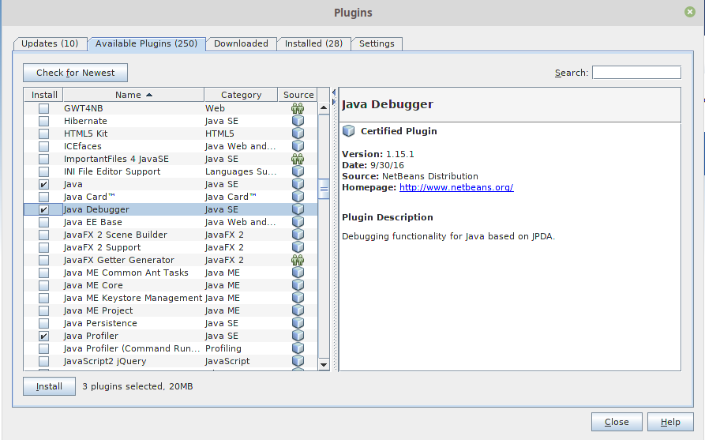
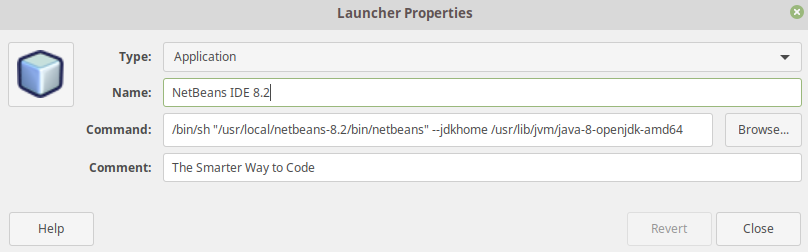
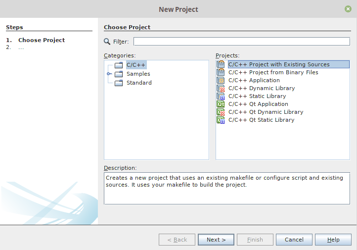
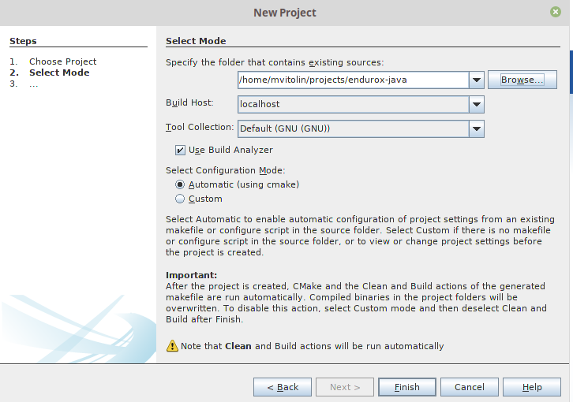
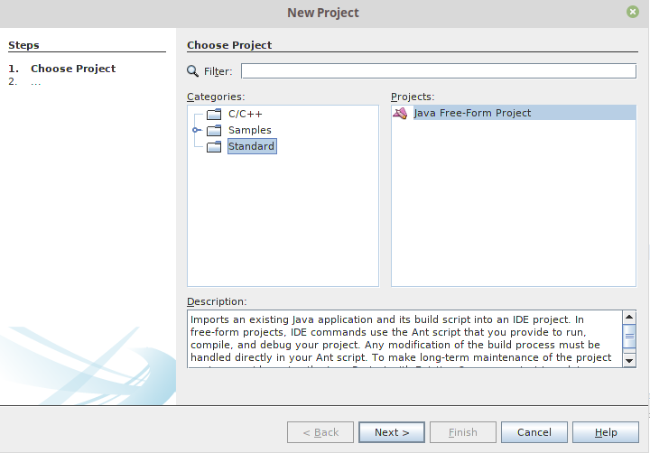
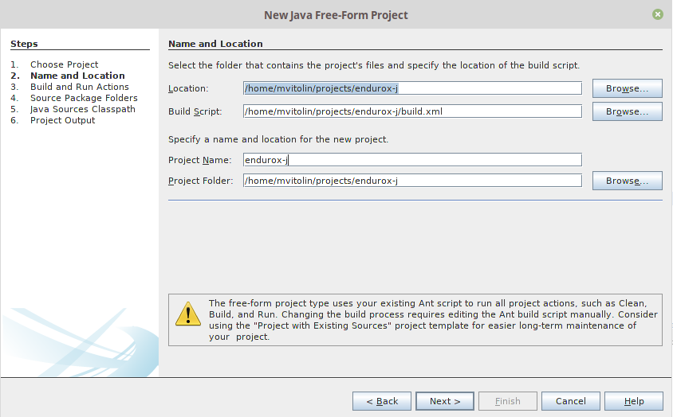
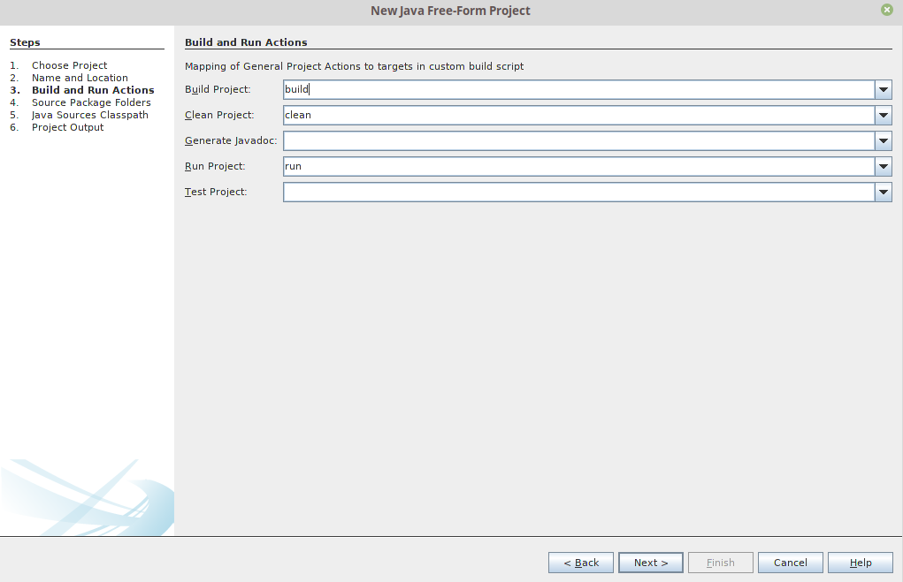
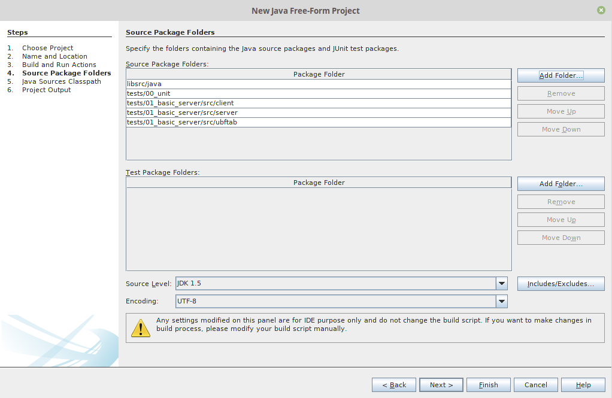
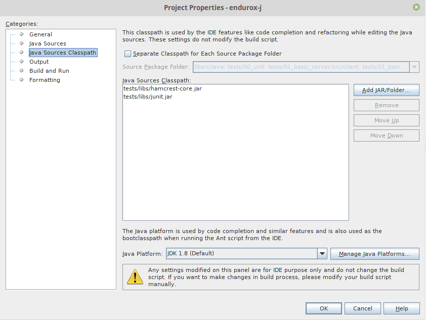

Enduro/X Java Internal Developer Guide
======================================
Madars Vitolins
v1.0, 2018-08:
        Initial draft
:doctype: book

== Intro

This document is for external and internal purposes of the 
Enduro/X Java module developer. It can be used for building the Enduro/X Java
package for further use. Document also contains the notes for Enduro/X Java
module developer.

It contains solutions for main pitfalls found during the development process.
Also document contains main configuration steps to get the development IDE
working.

Document starts with approach of building the Enduor/X Java module for external
use. Afterwards document describes the process for preparing the IDE for internal
module development process.

== Installing Java JDK

First of all to start using or developing Enduro/X Java language plugin, the JDK
needs to be installed. Enduro/X supports JDK version 1.7 and above.

=== CentOS/RHEL/Oracle Linux 7.X

To install the JDK for RHEL system, use following command:

--------------------------------------------------------------------------------

# yum install java-1.8.0-openjdk java-devel

--------------------------------------------------------------------------------

== Prepare Enduro/X for Build

The preparation for build also includes the step of downloading PostgreSQL JDBC
drivers, as these are used (if not disabled) for testing purposes of the XA
transactions. PostgreSQL database shall be already configured and users prepared.
The preparation process is described in 
building_guide(guides)(Building Enduro/X On GNU/Linux Platform, Testing PostgreSQL chapter).
Also note that environment variables in ~/ndrx_home must be configured i.e.
EX_PG_HOST, etc. variables must be configured in order the to establish the connection
to database.

=== Getting the source

--------------------------------------------------------------------------------

$ git clone https://github.com/endurox-dev/endurox-java
$ cd endurox-java

--------------------------------------------------------------------------------

=== Getting the PostgreSQL JDBC driver

Download the corresponding version from https://jdbc.postgresql.org/download.html.
For example version postgresql-42.2.6.jar.

 By assuming that you are in the endurox-java folder:

--------------------------------------------------------------------------------

$ cd tests/03_xapostgres/jdbcdrivers
$ wget https://jdbc.postgresql.org/download/postgresql-42.2.6.jar
$ mv postgresql-42.2.6.jar pgjdbc.jar

--------------------------------------------------------------------------------

=== Update environment variables

Enduro/X Java module requires libjava.so and libjvm.so (and other OS counterparts),
Thus the runtime library search path must be set correspondingly. To execute the
Enduro/X tests, the ~/ndrx_home source script must be updated:

For example on Oracle Linux 7:

--------------------------------------------------------------------------------

$ vi ~/ndrx_home

Add:

# Java settings
export JAVA_HOME=/usr/lib/jvm/java-1.8.0-openjdk-1.8.0.222.b10-0.el7_6.x86_64
export LD_LIBRARY_PATH=$LD_LIBRARY_PATH:/usr/lib/jvm/java-1.8.0-openjdk-1.8.0.222.b10-0.el7_6.x86_64/jre/lib/amd64:\
        /usr/lib/jvm/java-1.8.0-openjdk-1.8.0.222.b10-0.el7_6.x86_64/jre/lib/amd64/server

--------------------------------------------------------------------------------

=== Preparing to build and build

--------------------------------------------------------------------------------

$ cd endurox-java
$ cmake .
$ make

--------------------------------------------------------------------------------

=== Executing the unit tests

== NetBeans configuration

For Enduro/X and other related modules, NetBeans is preferred IDE for development.
As module is programmed in Java and C languages, two projects in NetBeans are
required. As NetBeans does not allow to project to co-exist in the same folder,
some play with symbolic links into separate folder are required. This document
will guide you for setting up the environment for developing Enduro/X for Java.

=== Packages for Java

This document assumes that NetBeans for C/C++ are installed. Thus to get
Java projects working, following additional plugins must be installed. As
plugins require JDK to be present for NetBeans, the IDE must be started with
'--jdkhome' attribute. In particular case NetBeans 8.2 was installed on Linux Mint
Mate 19 as a root. For this document we will use "java-8-openjdk-amd64".

--------------------------------------------------------------------------------

$  /usr/local/netbeans-8.2/bin/netbeans --jdkhome /usr/lib/jvm/java-8-openjdk-amd64

--------------------------------------------------------------------------------

Once NetBeans are started, go to: *Tools > Plugins > Available Plugins* and select
following ones for install:

Once modules are installed, it is recommended to update the NetBeans launcher 
shortcut, because the jdkhome argument is mandatory in order to use java projects

== Checking out Enduro/X Java project

With this step we will prepare two folders for the project. The first one is
default project folder "endurox-java" checked out from source repository. The
second one (which will be actually used by Java part for NetBeans) is created.
And symbolic links are added

--------------------------------------------------------------------------------

$ mkdir endurox-j
$ cd endurox-j
$ ln -s ../endurox-java/build.xml .
$ ln -s ../endurox-java/tests .
$ ln -s ../endurox-java/libsrc .

--------------------------------------------------------------------------------

== Opening projects in NetBeans

The main project is "endurox-java" which is processed by CMake. The CMake build
performs building of all parts Java and C. But for IDE we open this project for
as the C project.

=== Opening C project in NetBeans
Before opening the project in NetBeans, the cmake shall be run from shell, so
that it performs initial configuration, as with NetBeans the configuration
is little bit different:

--------------------------------------------------------------------------------

$ cd endurox-java
$ cmake .

--------------------------------------------------------------------------------

After this step is done, start the NetBeans, and create new project with existing
source code:

And then select the folder which checked out sources:

=== Opening Java project in NetBeans

The Java project shall be based on folder where symlinks are produced. That is
"endurox-j" folder. The project type is "Standard" Java free-form project. The
project contains an Ant script which is not normally used for build purposes, but
that is used for NetBeans (or Eclipse) to parse the project structure (CMake
is not supported yet for Java projects). Also during the development the
ant script (endurox-java/build.xml) must be maintained.

Create a new project:

Select project folder:

Ant commands:

Ant next screen is significant one, as here all Java directories must be manually
added, as the libsrc only is added by default. All unit tests which will be
changed/added during the development must be added here:

Once project is created, this list can be altered in 
*project properties > Java Sources*

Also the class path shall include the Junit JARS. The next screen shows how
to do it when project is configured, but that can be done during the initial
wizard too.

If adding new sources folder get similar message like this 
(Package folder already used in project):

Then this probably is caused by "endurox-java" C project. There is nothing to
do in such case except to go and manually edit the NetBeans project file in

*endurox-j/nbproject/project.xml* and add the necessary source folders to project,
in similar way as other source folders are added.

*The class path attributes*:

== Distributed transaction processing architecture

The nice thing about Java is that their JDBC drivers, are that they provide
two phase commit interfaces. The basic principle for the operations are the
same which are used by X/Open XA interface. See 
https://docs.oracle.com/javaee/5/api/javax/transaction/xa/XAResource.html.

Enduro/X by it self uses following architecture for the XA two phase transactions,
thus bindings added to Java shall support XA transactions too. There are known
"standard" java APIs for this like JTA, but Enduro/X brings as close as possible
XATMI API To Java, thus transactions are managed by XATMI API, which basically
consists of following methods:

- AtmiCtx.tpopen - Configure resource manager, create instance of XAResource
and XAConnection associated with ATMI Context

- AtmiCtx.tpclose - Disconnect from resource manager, delete XAResource and
XAConnection associated with ATMI Context

- AtmiCtx.tpbegin - Start the transaction

- AtmiCtx.tpsuspend - Suspend current transaction, put context outside of any
transaction

- AtmiCtx.tpresume - Resume suspend transaction, put context back into global
transaction

- AtmiCtx.tpcommit - Commit the transaction

- AtmiCtx.tpabort - Abort current transaction

- AtmiCtx.getConnection - get connect object from XAConnection. The pooling and 
closing of connection shall done by programmer.

The object hierarchy is as follows (Class diagram):

>>>> PIC: Object relactions here <<<

In the background of whole java module, following key principles are used:

- All meta data: Classes, Methods and Fields are cached, for performance reasons.

- Enduro/X thread local storage are used for running in C side during Java calls,
Special function ndrx_ctx_priv_get() is used to retrieve generic TLS fields
where data such as Java env, Java ATMI Context object reference, ptr to self
C context.

- When call from Java is made to C and when in turn C calls back Java (for XA
and Java XATMI servers) processing, these global variables are used.

>>>> PIC: Object/Global variables linkage and reuse for XA transactions <<<

The transaction management, communications with transaction manager (Enduro/X
*tmsrv* binary are performed by Enduro/X C libraries, but due to fact that
JDBC drivers live in Java side, the callbacks from C are done back to Java.
To get things more complex, Enduro/X uses standard approach of loading XA drivers
from C side shared library. Once Enduro/X Core together with Java modules are
booted, they are not aware of users willing to use JDBC, in fact Enduro/X Core
does not know anything about JDBC. But Enduro/X Java module provides special
library named "libndrxxajdbc.so" (our corresponding  counter part for MacOS),
which in turn expects in "NDRX_XA_RMLIB" (resource managers) configuration
parameter expects "libexjava.so" to set. The libexjava.so provides handler
to resolve the XA Switch. At startup static XADataSource is initialized. The
initialization is done by parsing JSON configuration string found in *NDRX_XA_OPEN_STR*.
The syntax for Open String is following

--------------------------------------------------------------------------------

{"class":"<JDBC Driver Class Name>", 
        "set": {
                "<Set Method Of Class Object 1>":"<Value to bet set 1>"
                ,"<Set Method Of Class Object 2>":"<Value to bet set 2>"
                ,"<Set Method Of Class Object N>":"<Value to bet set N>"
                ,"<Set Method of Properties 1": {
                        "<Property 1 Setting 1>":"<Value to bet set 1/1>"
                        "<Property 1 Setting N>":"<Value to bet set 1/N>"
                    }
                }
        }

--------------------------------------------------------------------------------

Thing is that Configuration of XA JDBC Drivers are not standard. There is no
standard set of XADataSource methods to configure the driver. Thus Enduro/X uses
generic approach to create driver instance and configure it via JSON configuration
string. This string accepts:

1. Class name (NOTE! The JDBC driver must be loaded either via linkage or by 
classpath)

2. A group of set method names and their values. The value types accepted are:
*Short*, *Long*, *Integer*, *Byte*, *Float*, *Double*, *Boolean*, *String*. The
values for these data types are parsed as strings.

3. An setter method accepting *java.util.Properties*, accepts JSON sub-objects
with string values.

And example of XA Open String is following (used by Oracle thin JDBC Driver):

--------------------------------------------------------------------------------

[@global/DB1_JDBC]
NDRX_XA_RES_ID=1
NDRX_XA_OPEN_STR={"class":"oracle.jdbc.xa.client.OracleXADataSource", 
        "set": {
                "setUser":"${EX_ORA_USER}"
                ,"setPassword":"${EX_ORA_PASS}"
                ,"setURL":"jdbc:oracle:thin:@${EX_ORA_HOST}:${EX_ORA_PORT}/${EX_ORA_SID}"
                ,"setConnectionProperties":{
                        "defaultRowPrefetch":"2"
                        ,"oracle.jdbc.TcpNoDelay":"true"
# Number in milliseconds
                        ,"oracle.jdbc.ReadTimeout":"6000"
                        }
                }
        }
NDRX_XA_CLOSE_STR=${NDRX_XA_OPEN_STR}
NDRX_XA_DRIVERLIB=${NDRX_APPHOME}/../../xadrv/libndrxxajdbc.so
NDRX_XA_RMLIB=${NDRX_APPHOME}/../../libsrc/c/libexjava.so
NDRX_XA_LAZY_INIT=1

--------------------------------------------------------------------------------

The XADataSource is configured during the XATMI Startup or during the first
XA call (if lazy init is used).

Overall the library dependencies can be seen in following diagram:

>>>>> LIBRARY DEPS <<<<<<<<<

=== Transaction Manager operations with JDBC drivers

Enduro/X transaction manager *tmsrv(8)*, is not aware of the Java. The only thing
it processes is XA Driver loaded by *NDRX_XA_DRIVERLIB* configuration parameter.
Which in turn provides the Enduro/X Java binding module *libexjava.so* found
in *NDRX_XA_RMLIB*. The JDBC XA library finds out that this is not java which
initiated driver loading, thus new Java Virtual Machine instance is created
and hosted within tmsrv. VM is configured with settings form [@java] (with CCTAG
support) section. Thus there shall be class path configured with -cp or -classpath
settings in Java opts. From this class path further the JDBC XA Data Source
class is loaded. 

== Enduro/X Java XA Test Configuration

In order to perform testing of Oracle (02_xaoracle), Posgresql (03_xapostgres)
and Mysql/MariaDB (04_xamysql) the databases and environment must be configured.

The environment contains host names, users, passwords and database names. The
build process will automatically skip these tests, if environment is not configured.

=== Configuration of Oracle DB tests
...
=== Configuration of Posgresql DB tests
...
=== Configuration of Mysql/Maria DB tests
...

== Object lifecycle for XATMI clients and Servers
...

== Enduro/X Java Linker
...

:numbered!:

[bibliography]
Additional documentation 
------------------------
This section lists additional related documents.

[bibliography]
.Internet resources
- [[[ATMI-API]]] http://docs.oracle.com/cd/E13203_01/tuxedo/tux71/html/pgint6.htm
- [[[FML-API]]] http://docs.oracle.com/cd/E13203_01/tuxedo/tux91/fml/index.htm

[glossary]
Glossary
--------
This section lists

[glossary]
ATMI::
  Application Transaction Monitor Interface

UBF::
  Unified Buffer Format it is similar API as Tuxedo's FML

////////////////////////////////////////////////////////////////
The index is normally left completely empty, it's contents being
generated automatically by the DocBook toolchain.
////////////////////////////////////////////////////////////////
